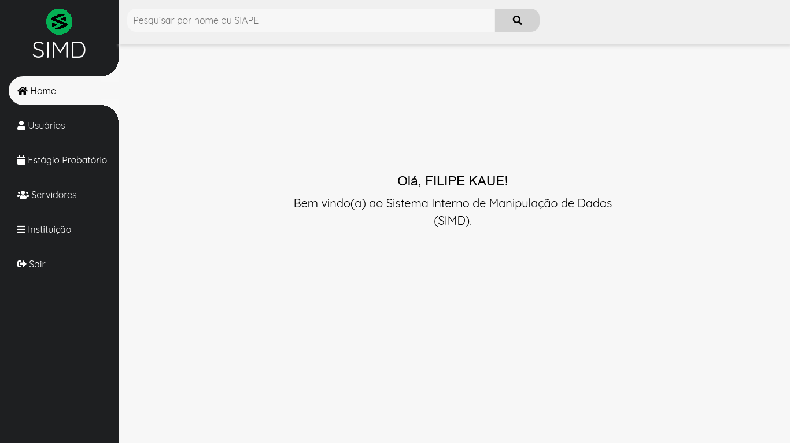

<!-- PROJECT LOGO -->
 

  

  <h3 align="center">SIMD</h3>

  

     Sistema Interno de Manipulação de Dados do Instituto Federal do Pará - Campus Tucuruí 
    

<!-- SOBRE O PROJETO -->
## Sobre o Projeto
O Sistema Interno de Manipulação de Dados foi desenvolvido por nove alunos do Instituto Federal do Pará - Campus Tucuruí para servir a Coordenação de Gestão de Pessoas do mesmo. Criado para armazenar e gerênciar os dados pessoais do corpo doscente e administrativo do campus.

  
